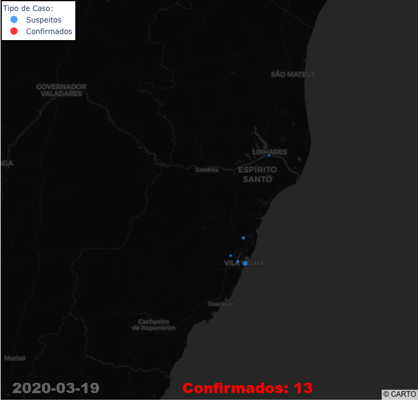
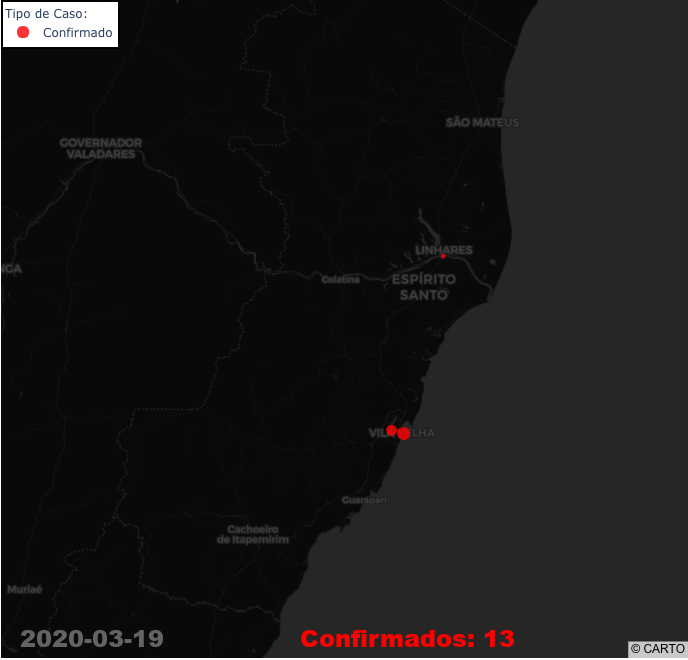

# Animated Map (gif/mp4) of COVID-19 cases in Espirito Santo, Brazil.

This is the first version: quick and dirty!

Occurrences per city started to be reported in March, 19th:  https://coronavirus.es.gov.br/noticias 

### Dark Mode

### Normal Mode

## Tested Cases Only

